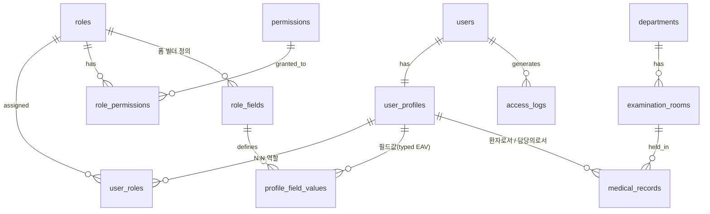

# 병원 진료기록 조회 시스템

관리자가 코드 수정 없이 **역할·권한·입력필드를 화면에서 정의**하는 동적 RBAC(SaaS Starter Kit) 구조 위에 구축된 병원 진료기록 웹 애플리케이션입니다. 병원 도메인(진료기록·진료과목·접근로그)은 이 코어 위의 앱 모듈로 동작합니다.

**라이브 데모:** https://frontend-production-2e582.up.railway.app/login


---

## 주요 기능

### 코어 (노코드 RBAC)

- **역할 관리** — 관리자가 화면에서 역할 생성·수정 (예: "간호사" 역할을 개발 없이 추가)
- **권한 조합** — 권한 카탈로그(개발자 시드)에서 체크박스로 역할별 권한 구성. API는 역할명이 아닌 **권한 코드**로만 접근 판정
- **폼 빌더** — 역할별 입력필드를 화면에서 정의(타입·필수·유니크·검증규칙·도움말 등 13속성). 계정 발급 폼이 이 정의로 동적 렌더링
- **계정 발급** — 셀프 가입 없음. `users:create` 권한 보유자(관리자·원무과)가 발급 — 초대 이메일 링크(기본) 또는 임시 비밀번호(첫 로그인 변경 강제)
- **다중 역할** — 한 사용자가 여러 역할 보유 가능(권한은 합집합), 기본 역할이 로그인 첫 화면 결정

### 병원 모듈

| 역할(시드) | 기능 |
|------|------|
| 관리자 | 사용자·역할·권한·진료과목·진료실 관리, 전체 진료기록·접근로그 조회 |
| 의사 | 담당 환자 목록·환자 검색, 진료기록 작성·수정·조회 |
| 환자 | 본인 진료기록 목록·상세 조회 |
| 원무과 | 계정 발급·사용자 관리 (진료기록 접근 불가) |

---

## 기술 스택

| 영역 | 기술 |
|------|------|
| 프론트엔드 | Next.js 16 (App Router), React 19, TypeScript, TanStack Query v5, CSS Modules |
| 디자인 | SLUR Design System — 시맨틱 토큰 2계층(라이트/다크), Pretendard, 4px 스페이싱 |
| 백엔드 | FastAPI (Python), JWKS(ES256) JWT 검증, 권한 코드 기반 인가 계층 |
| 인증·DB | Supabase (PostgreSQL + Auth) |
| 모바일 | Flutter + webview_flutter (WebView 쉘) |
| 배포 | Railway (프론트·백엔드), Supabase Cloud |

---

## 아키텍처

```
브라우저 / Flutter WebView
    │
    ▼
Next.js (Railway)
 ├─ proxy.ts        ← 인증만 판정 (세션 유무·비밀번호 변경 강제)
 ├─ 권한 기반 메뉴    ← GET /api/me 의 permissions 로 노출 결정
 └─ app/api/*       ← BFF: 쿠키에서 토큰 추출 → FastAPI로 전달 (판정 없음)
         │
         ▼
    FastAPI (Railway)
      ├─ JWT 검증(JWKS, ES256)
      ├─ require_permission("records:create") ← 인가의 유일한 판정자
      │    (user_roles ⋈ role_permissions 합집합, TTL 캐시 60s)
      └─ Supabase PostgREST / Auth
```

- **인증은 프록시, 인가는 백엔드** — 프론트의 메뉴 숨김은 UX일 뿐, 보안 경계는 FastAPI의 권한 검사입니다.
- 프론트엔드는 DB에 직접 접근하지 않습니다 (BFF 패턴).
- URL은 역할이 아닌 **기능 기준**: `/records` `/patients` `/users` `/roles` `/departments` `/access-logs`
- 코어(인증·RBAC·폼빌더·감사)와 앱 모듈(병원 도메인)은 분리되어 있으며, 코어는 도메인을 모릅니다.

---

## 데모 계정

| 역할 | 이메일 | 비밀번호 |
|------|--------|----------|
| 관리자 | admin@hospital.test | Admin123! |
| 의사 | doctor01@hospital.test | Doctor123! |
| 환자 | patient01@hospital.test | Patient123! |
| 원무과 | staff01@hospital.test | Staff123! *(seed.py 실행 시 생성)* |

> 데모용 계정입니다. 실제 운영 자격증명이 아닙니다.

---

## 데이터베이스 설계 (ERD v3)



**주요 설계 결정:**

- **2계층 접근 제어** — 역할은 데이터(관리자가 생성), 권한은 코드가 검사하는 카탈로그(개발자 시드). API는 `records:create` 같은 권한 코드로만 판정하므로 역할이 몇 개든 코드는 불변입니다.
- **동적 필드 = 정의(role_fields) + 값(profile_field_values)** — 값은 타입별 컬럼(text/number/date/boolean/json)에 저장해 필드 단위 유니크·범위 검색이 DB 인덱스로 동작합니다 (JSONB가 아닌 typed EAV를 쓴 이유).
- **진료기록 불변성** — 삭제 불가. 오기입 시 `is_corrected=true` 표시 후 새 기록 작성 (의료 기록 보존 원칙).
- **접근 로그 Append-only + 일반화** — `resource_type`+`resource_id`로 어떤 모듈의 자원이든 감사 기록 (진료기록 조회, 역할 변경 등).
- **Supabase Auth 비침습** — Auth의 `users`는 직접 수정하지 않고 `user_profiles`로 1:1 확장. 이메일의 단일 원본은 Auth.

상세 스키마: [`docs/dbdiagram-v3-rbac.dbml`](docs/dbdiagram-v3-rbac.dbml) *(v1: [`docs/dbdiagram-import.dbml`](docs/dbdiagram-import.dbml))*

> ERD는 [dbdiagram.io](https://dbdiagram.io)에서 다이어그램으로 시각화·검증하며 설계했습니다. `.dbml` 파일을 임포트하면 동일한 다이어그램을 확인할 수 있습니다.

---

## 로컬 실행

### 사전 준비

- Node.js 20+, Python 3.11+
- Supabase 프로젝트 (마이그레이션 적용 필요: `supabase/migrations/` 순번대로)

### 백엔드

```bash
cd backend
cp .env.example .env   # 환경변수 채우기
pip install -r requirements.txt
uvicorn main:app --reload
# → http://localhost:8000
```

### 프론트엔드

```bash
cd frontend
npm install
# .env.local 생성:
# NEXT_PUBLIC_SUPABASE_URL=...
# NEXT_PUBLIC_SUPABASE_ANON_KEY=...
# FASTAPI_URL=http://localhost:8000
npm run dev
# → http://localhost:3000
```

### 시드 데이터

```bash
python scripts/seed.py   # backend/.env 의 SERVICE_ROLE 키 사용
# 진료과목 5·진료실 10·의사 10·환자 20·진료기록 50+ / 역할·권한·필드값 포함 (멱등)
```

### 테스트 (백엔드)

```bash
cd backend
pip install -r requirements-dev.txt
pytest                                        # 단위 + 통합 (배포 백엔드 대상)
BACKEND_URL=http://localhost:8000 pytest      # 통합 테스트를 로컬 대상
pytest tests/test_nocode_e2e.py               # 노코드 E2E — 역할 생성→권한→필드→발급→로그인 전 과정
```
