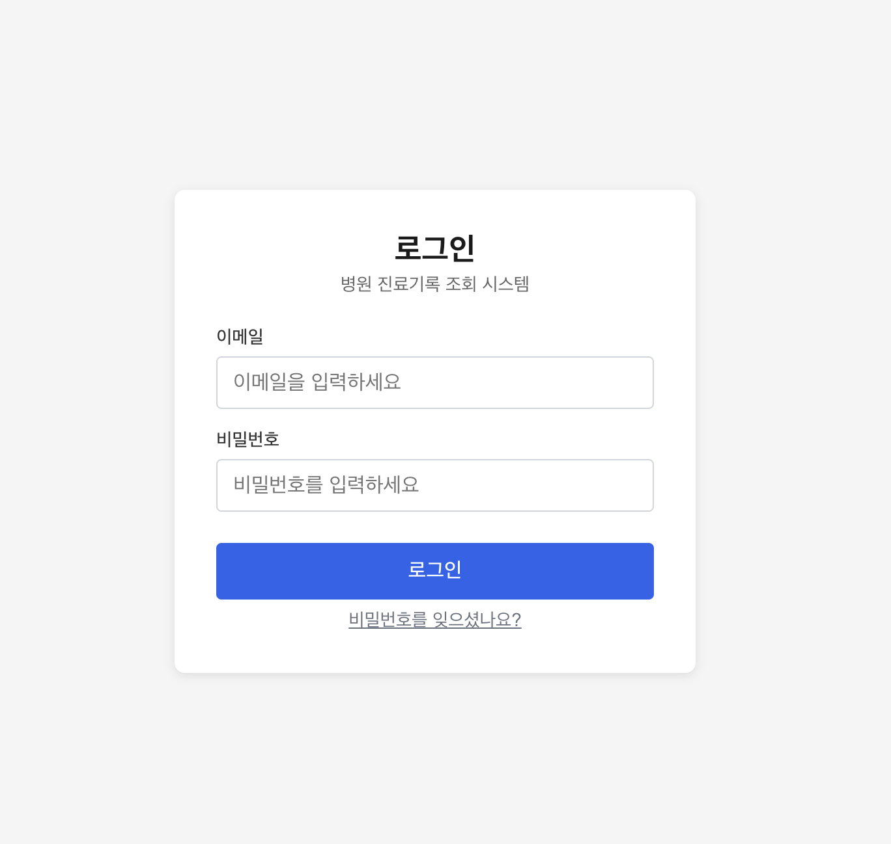
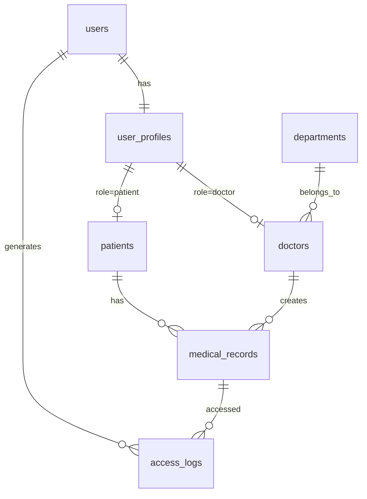

# 병원 진료기록 조회 시스템

환자·의사·관리자 3개 역할을 지원하는 병원 진료기록 웹 애플리케이션입니다.

**라이브 데모:** https://frontend-production-2e582.up.railway.app/login



---

## 주요 기능

| 역할 | 기능 |
|------|------|
| 관리자 | 부서·진료실·의사 계정·환자 정보 관리, 접근 로그 조회 |
| 의사 | 담당 환자 목록·검색, 진료기록 작성·수정·조회, 첫 로그인 시 비밀번호 변경 |
| 환자 | 본인 진료기록 목록·상세 조회 |

---

## 기술 스택

| 영역 | 기술 |
|------|------|
| 프론트엔드 | Next.js 16 (App Router), React 19, TypeScript |
| 백엔드 | FastAPI (Python), python-jose, httpx |
| 인증·DB | Supabase (PostgreSQL + Auth + RLS) |
| 모바일 | Flutter + webview_flutter (WebView 쉘) |
| 배포 | Railway (프론트·백엔드), Supabase Cloud |

---

## 아키텍처

```
브라우저 / Flutter WebView
    │
    ▼
Next.js (Railway)
 ├─ proxy.ts        ← 역할 기반 라우팅 가드 (미들웨어)
 └─ app/api/*       ← BFF: 쿠키에서 토큰 추출 → FastAPI로 전달
         │
         ▼
    FastAPI (Railway)
      └─ JWT 검증(JWKS) → Supabase PostgREST / Auth
```

- 프론트엔드는 DB에 직접 접근하지 않습니다. `app/api/**` 라우트 핸들러가 Supabase 세션 쿠키에서 토큰을 추출해 FastAPI에 전달하는 BFF(Backend For Frontend) 역할을 합니다.
- 회원가입은 관리자만 가능합니다. `/register` 경로는 외부에서 접근할 수 없습니다.

---

## 데모 계정

| 역할 | 이메일 | 비밀번호 |
|------|--------|----------|
| 관리자 | admin@hospital.test | Admin123! |
| 의사 | doctor01@hospital.test | Doctor123! |
| 환자 | patient01@hospital.test | Patient123! |

> 데모용 계정입니다. 실제 운영 자격증명이 아닙니다.

---

## 데이터베이스 설계

ERD는 직접 설계했으며, 의료 도메인 특성을 반영한 구조입니다.



**주요 설계 결정:**

- **진료기록 불변성** — 기록은 삭제하지 않습니다. 오기입 시 `is_corrected=true`로 표시하고 새 기록을 작성합니다 (실제 의료 도메인 관행 반영).
- **접근 로그 Append-only** — `access_logs`는 RLS로 INSERT만 허용, 수정·삭제 불가. 감사 추적의 무결성을 보장합니다.
- **역할 분리 구조** — `user_profiles`로 모든 역할의 공통 정보를 관리하고, 역할별 고유 속성은 `doctors` / `patients` 테이블로 분리합니다.
- **Supabase Auth 비침습** — Auth가 관리하는 `users` 테이블은 직접 수정하지 않고 `user_profiles`로 1:1 확장합니다.

상세 스키마: [`docs/dbdiagram-import.dbml`](docs/dbdiagram-import.dbml)

> ERD는 [dbdiagram.io](https://dbdiagram.io)에서 다이어그램으로 시각화·검증하며 설계했습니다. 위 `.dbml` 파일을 dbdiagram.io에 임포트하면 동일한 다이어그램을 확인할 수 있습니다.

---

## 로컬 실행

### 사전 준비

- Node.js 20+, Python 3.11+
- Supabase 프로젝트 (마이그레이션 적용 필요: `supabase/migrations/`)

### 백엔드

```bash
cd backend
cp .env.example .env   # 환경변수 채우기
pip install -r requirements.txt
uvicorn main:app --reload
# → http://localhost:8000
```

### 프론트엔드

```bash
cd frontend
npm install
# .env.local 생성:
# NEXT_PUBLIC_SUPABASE_URL=...
# NEXT_PUBLIC_SUPABASE_ANON_KEY=...
# FASTAPI_URL=http://localhost:8000
npm run dev
# → http://localhost:3000
```

### 시드 데이터

```bash
python scripts/seed.py   # backend/.env 의 SERVICE_ROLE 키 사용
```

### 테스트 (백엔드 통합 테스트)

```bash
cd backend
pip install -r requirements-dev.txt
pytest                                        # 배포 백엔드 대상
BACKEND_URL=http://localhost:8000 pytest      # 로컬 대상
```
